# Activité Pratique N°2 : Spring MVC - Spring Data JPA, Hibernate

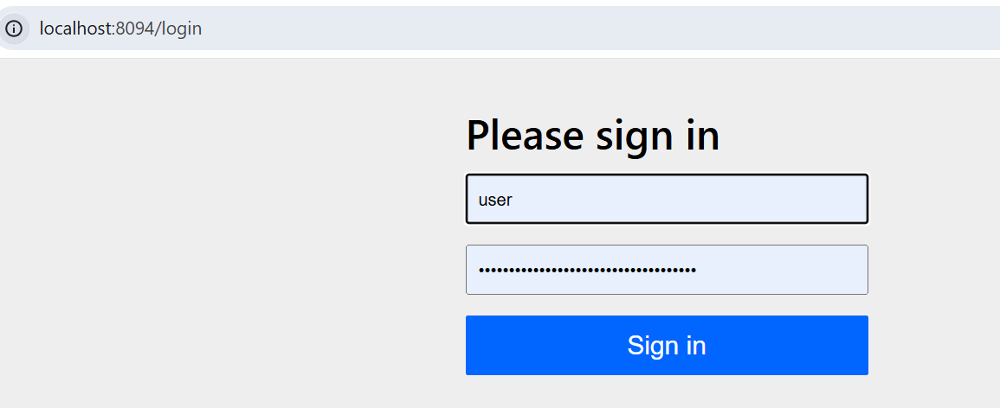
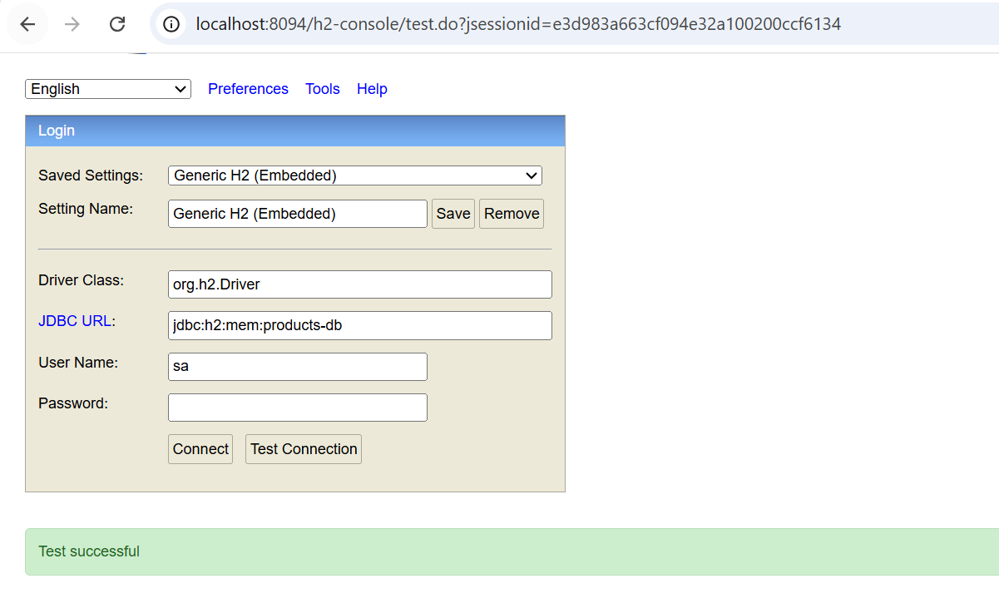
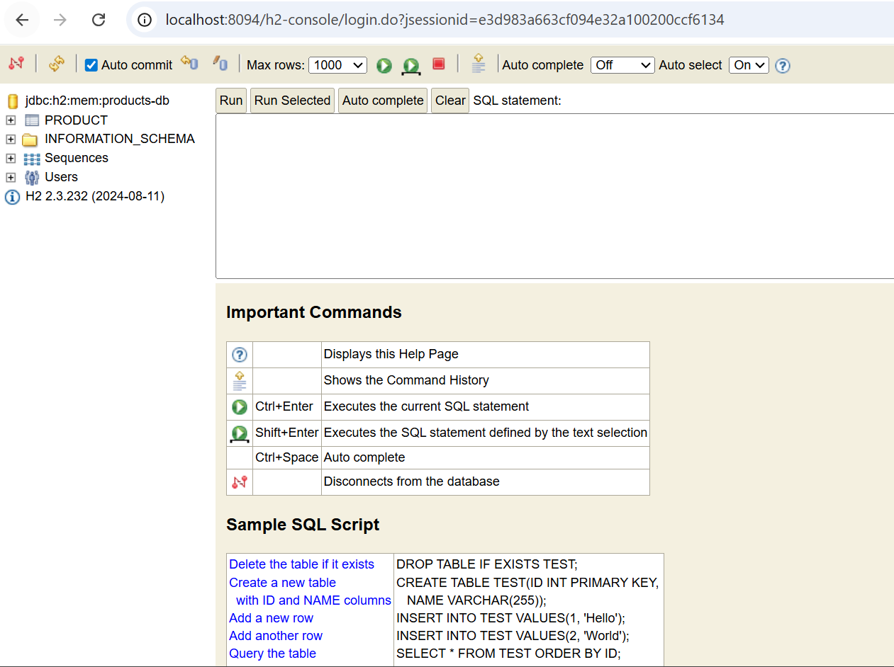
Injection des dépendances soit avec @Autowired, soit avec un constructeur sans arguments.
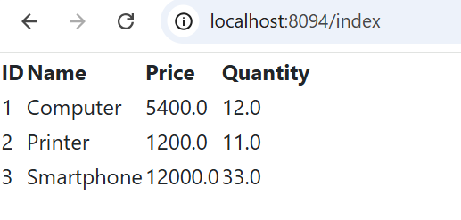
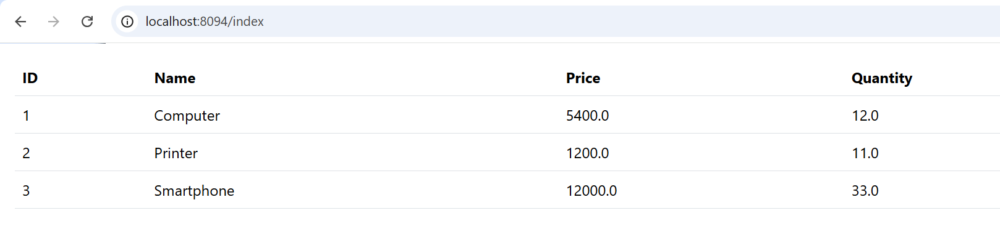

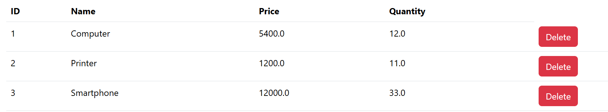
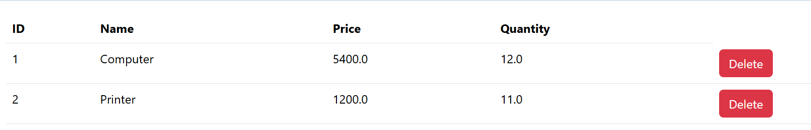

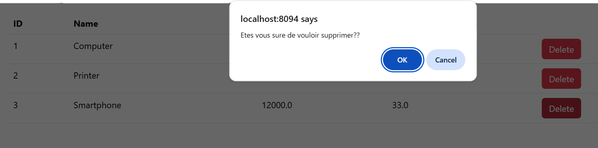
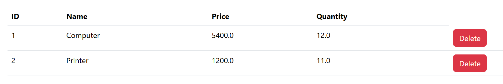
Ajout de la dépendance Thymeleaf Layout pour gérer les layouts.

Après, on décore les pages produits avec le layout.
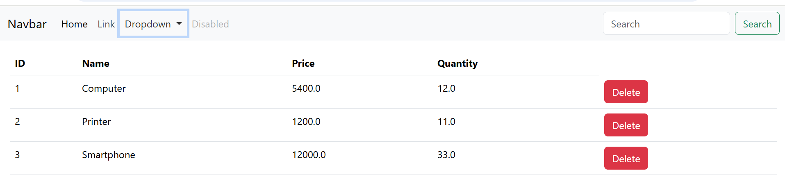
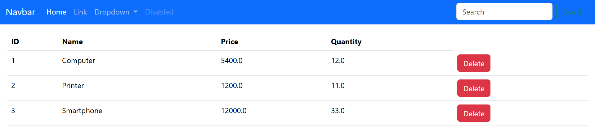

On associe des href à chaque lien :

- / → Home
- /products → Liste des produits

## Ajout des fonctionnalités Produits
. Création de la page New Product
. Ajout de la route saveProduct

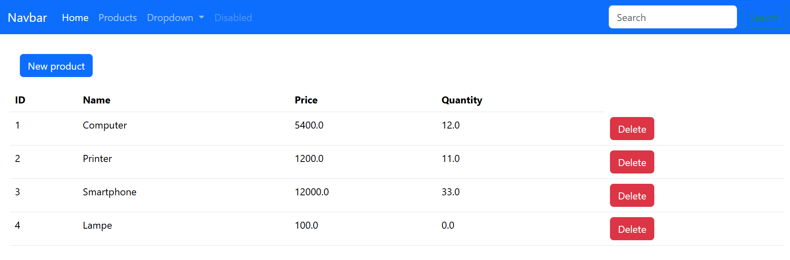

. Test d’ajout de produit ✔️
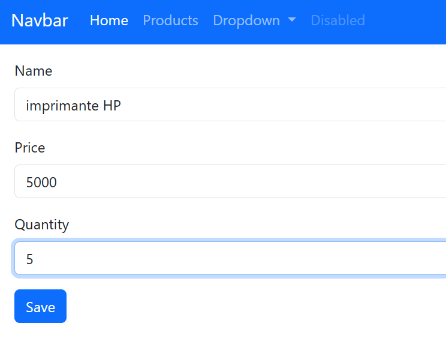
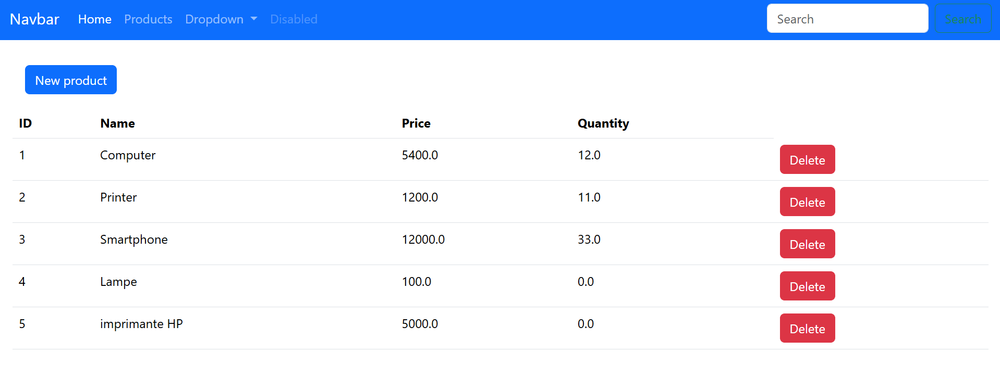

## Partie 2 : Spring Security

On ajoute la dépendance Spring Boot Starter Security.

Pour utiliser Spring Security avec Thymeleaf, on peut désactiver temporairement la sécurité pour tester.

Quand on relance l’application, Spring demande un username et password, car l’authentification est activée par défaut. 

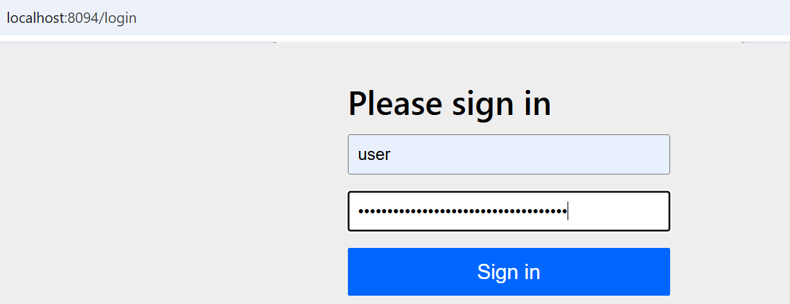
et ca marche
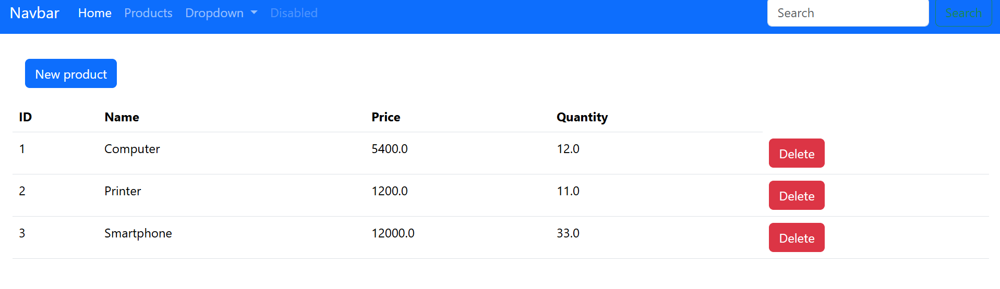png](images/activation_spring_security.png)

Configuration de la sécurité

On crée une classe de configuration (SecurityConfig) :

## Activation avec @EnableWebSecurity
Configuration des accès :
Si l’utilisateur n’est pas authentifié → redirection vers login
Toutes les requêtes nécessitent une authentification

Ajout d’un encodeur de mot de passe (BCryptPasswordEncoder).
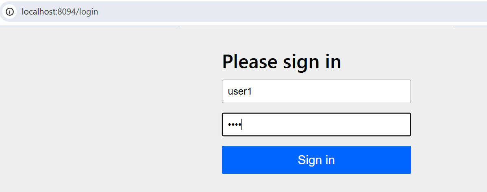 
Concepts importants
Hashing : transformation irréversible (ex: BCrypt)
Encoding : réversible (ex: Base64)
Cryptage :
Symétrique (même clé)
Asymétrique (clé publique / privée, ex: RSA)
Ici, on utilise le hashing (BCrypt).

Authentification

Les mots de passe sont stockés hachés dans la base de données.

Après authentification :

Un utilisateur avec rôle USER ne peut pas supprimer un produit ❌
Erreur 403 (Forbidden) = accès non autorisé
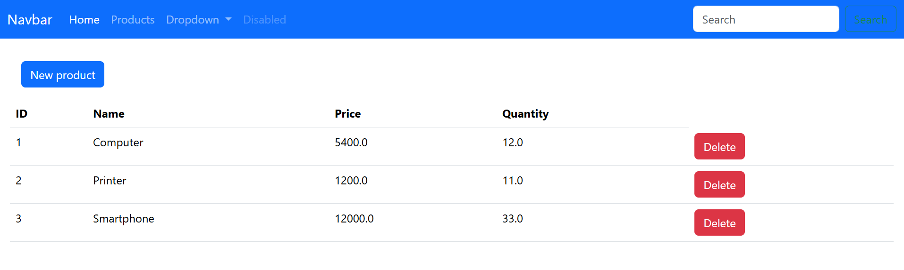
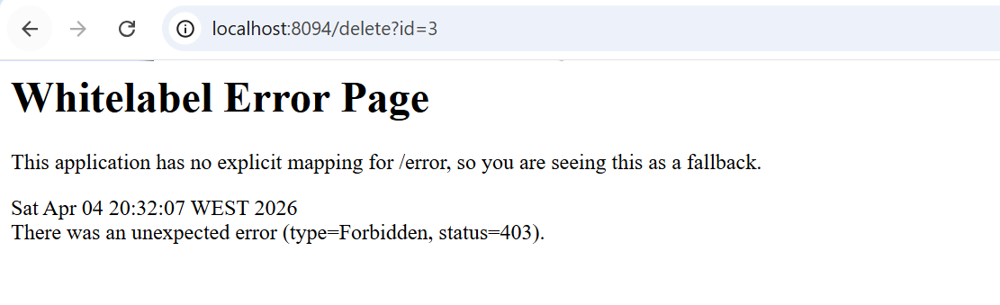

Gestion des rôles
hasRole("ADMIN") → accès admin uniquement
permitAll() → accès public sans authentification

Ajout de routes :

/admin/delete
/admin/save

 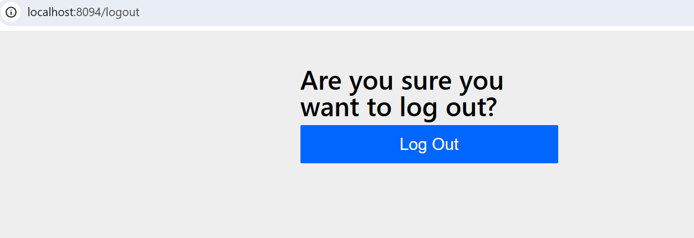
on se connecte au admin 
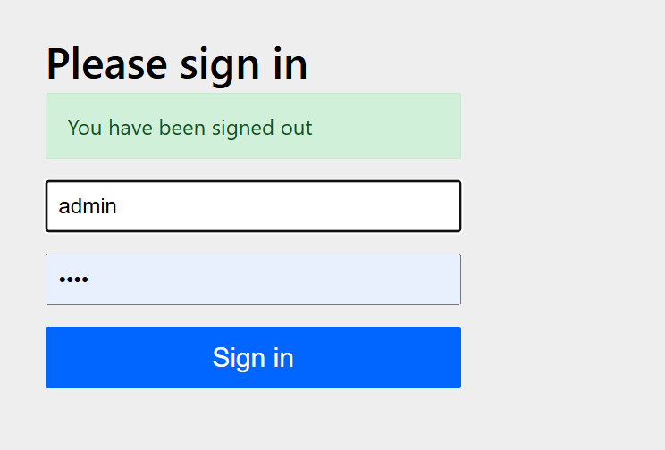
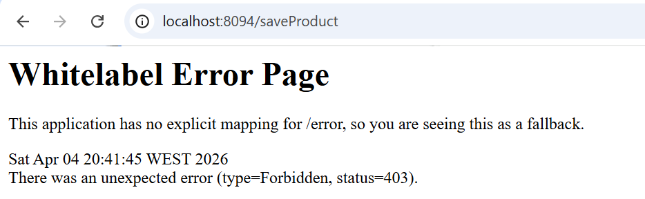
car ca nessecite une authentif avec role admin
La on essaye de suppr et ajoute un m poduit c bon ca marche
Prod ajoute:
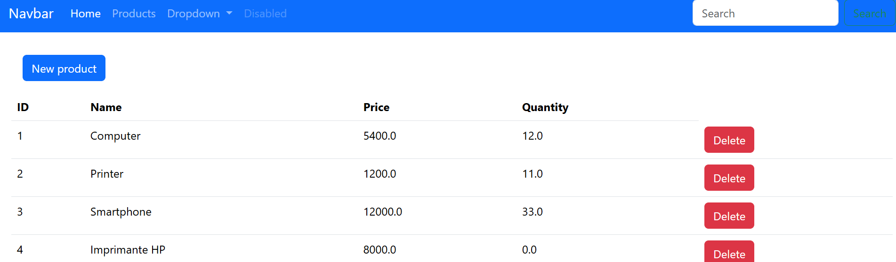
Prod Supr:
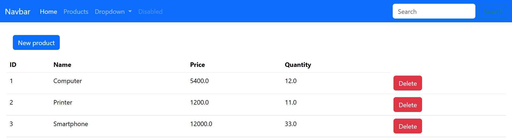
tt necessite auth avec lu role seul /public grace a permit all cad autorise sans authenitf
hasrole necessite authentif aevc un role

on passe a changer dans notre controller par /admin/delet /admin /savre etc
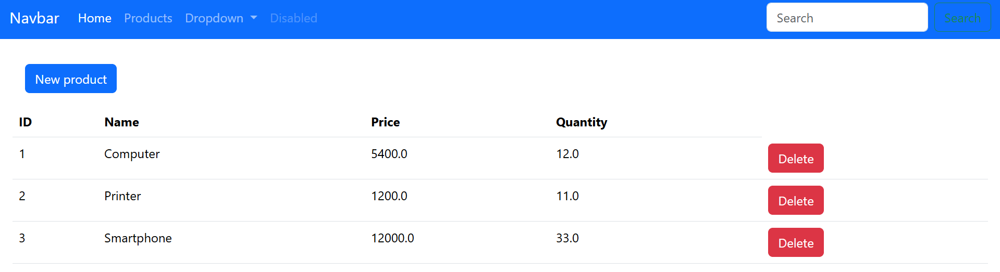

on ajoute namespace sec tehulead extras pour affic he nom user authentif 
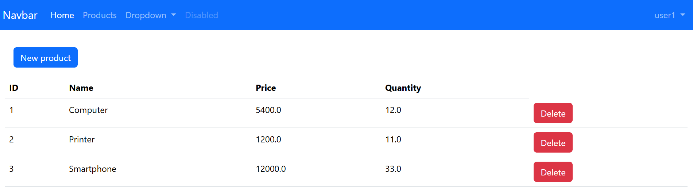
Gestion des erreurs

Créer une page Not Authorized (403) pour une meilleure UX.
ne pas affiche rla page derr 403 c mieux  de le redigier vers une page exececption handling , not authorised
Not authorized paeg jessaye de suppr ca saffiche
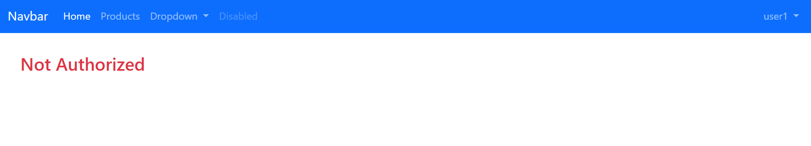
Mainteant on va cacher les btns supprimer et ajouter sur les users 
et lafficher a condition si la security est authorized
via le code sec:authorize="hasRole('ADMIN')"
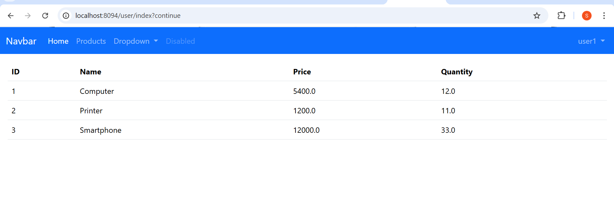

jessaye de supprimer depuis lurl pour voir si ca marche ou nn 

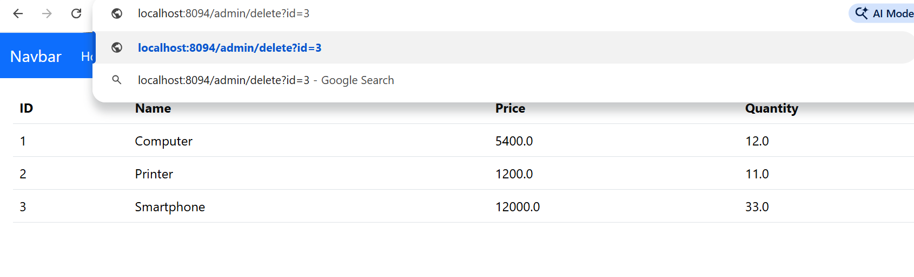
et voila je suis non authorise 

Session et Cookies

Spring Security utilise une authentification stateful :

Création d’une session
Stockage dans un cookie JSESSIONID
HttpOnly → non accessible via JavaScript

nous avons essaye avec admin ca marche
ici on utilise la meth dauthentif statefull
ms en authntifiant il renvoie set cookie
spring ssec verifie mdp e cree session t renvoie la session ss forme de cookie  et le browser la sstocke   cote navigatur
son nom c jsession id
httponly cad qu cookie qui ne peux pas etre lit aevc java script
a chaue fosi en envoie un req on envoie uen session id et lui il cherche sil est ouvrerte deja et si jai droit deffceur loperartion ou non
qund vous utilsier les cookies vous etes atcker a lattacke csrf car le num de session est stockes dans les cokies de votre browser ms si un vous envoie un email cliquer pour decouvrir un chose si vosu cliquer vous allz snvoir un req a votre serveur pour fiare une acion non voulu et la le browser renvoie les cookies aussi car il toruve que la session est ouverte
une fosi vous utilsier les cookies vous tes en attques de csrf
et pour corriger ca il faux a caue fois un user demande un form il lenvoie avec un champs cachue qui est csrf token
a chaue fois il ajoute un champos hiden qui est tken pour que server le reccupere dans la session si c le mem il laisse passe sinn il refuse la requette car il va considerer que lqreq provient dune paeg fournit par server ou dun forme non voulu 
spring sec utilise par defaur cette protection par exple si vosu authentif en tq admin et si vous voulez saisir les donnees  si on regde lform cote navigateur on va trouver le csrf token de facon cach mmme si elle nest pas affcieh dans le form je lenvoie avec ms donnees sans savoir pour eviter csrf 
Attaque CSRF

Problème :

Le navigateur envoie automatiquement les cookies
Risque d’exécuter une action sans consentement

Solution :

Token CSRF dans les formulaires
Vérification côté serveur

Spring Security active cette protection par défaut.
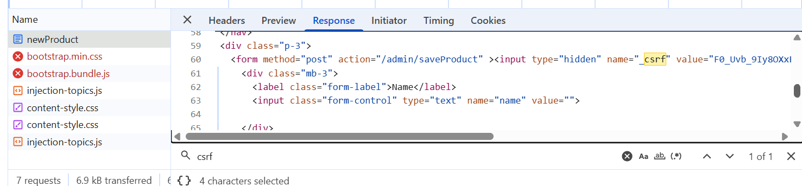

pour la desctiver on met .csrf.disable()
prq on va la desactiv par exple si on veut utilsie rstateless
la on verifie le cha mos ne reste plus 

ms maintenant on exposer a tt force non voulez par exple suppression non voulu  en cliquent un lien on doit maintenna resoudre ce prob
cad on envoie nos cookie pour suppr sans savoir ca et pour se faire
on doit lactiver avec protection apr defaut 
on reacrive protecion csrf pour le moment et c bon maitnent c protge
avec activer protection aevc defaut 

ms reste prob avec delete  ms delete mapping au lieu de get mapping
c pour cela que aevc dellete il faut jamis utilsier get
c pour cela on doit faire un from avec meth delelte
ms ya pas meth delete on utilsie post
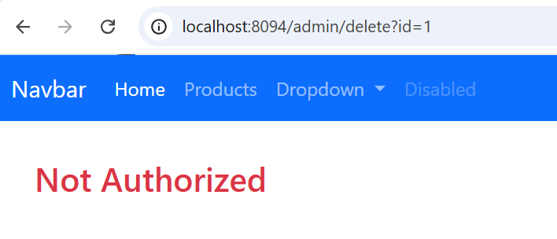
ca ne pemet pas ca
donc jamais utilsier gt pour save et dlete
car jaurai pu luilser sasn qu je lutilsie post c comme delete 

on cree notre form personnalise dauthtif
via                 .formLogin(fl->fl.loginPage("/login"))
on cree la page de login et on lautorize i avec 
securilty  via permitall sinn il va nmecessit un auth
ms le prob que tu utilsie bbotstrap et tu na pas le droit de lui acceder c pour cela il faut ajout ajouter webjar en permit all
on ajoute le logout pu fermer la session via session ionvalisdate
voila la page login ca marche 
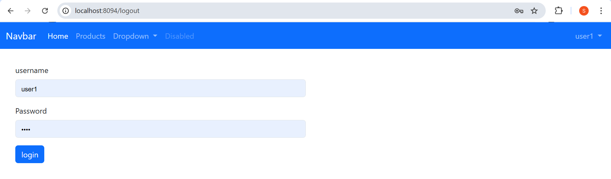
c bon on est en home
on restype le login et c bon
Login style

comemnt protger lapp  
via auhtorzed requst ou pre authorized(has role ) ou enabled
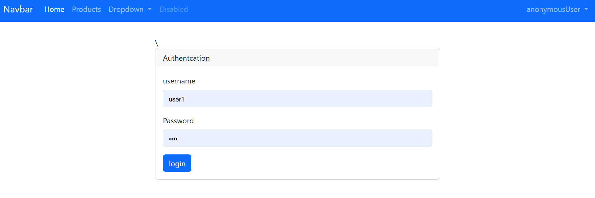

2 meth pour proter les app : on peux utilsier les deux
authorizehhtp enable ...  ou le annotation dans controller 

si on dmd form c not authorized
image not 
autorize http request cad que vous avez une classe de config ou vous config de securite

    //apres on va lutiliser pas ms on le securise avec json web token et au lieu de ca on utlise user web details
